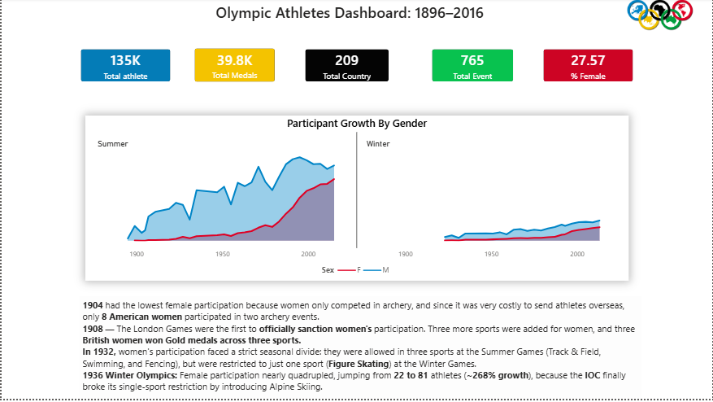
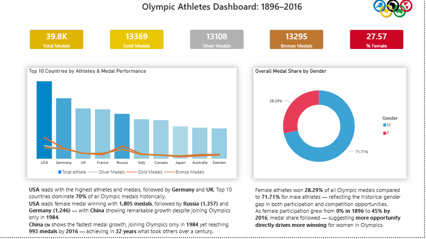
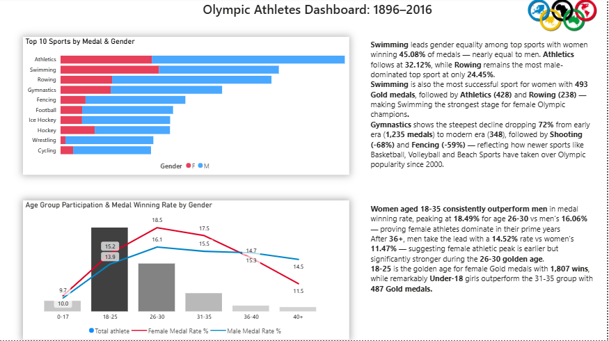

# 🏅 Olympic Athletes Dashboard: 1896–2016

A comprehensive Power BI dashboard analyzing 120 years of Olympic history, 
built using PostgreSQL and DAX measures.


## 🔗 Dashboard File
[Download Power BI Dashboard](olympics.pbix)

---

## 📸 Dashboard Preview

### Page 1 — Overview


### Page 2 — Nations & Medals


### Page 3 — Sports & Athletes


---
---

## 📊 Dashboard Overview

| Page | Name | Content |
|------|------|---------|
| 1 | **Overview** | Gender growth chart, KPI cards, Historical insights |
| 2 | **Nations & Medals** | Top countries, Gender donut, Medal KPIs |
| 3 | **Sports & Athletes** | Top sports, Age group analysis |

---

## 🛠️ Tools Used

| Tool | Purpose |
|------|---------|
| **PostgreSQL** | Data storage & SQL queries |
| **Power BI** | Dashboard & visualizations |
| **DAX** | Custom measures & calculations |
| **pgAdmin 4** | Database management |

---

## 📁 Dataset

- **Source:** Olympic Athletes Dataset 1896–2016
- **Table:** `athlete_events`
- **Records:** 270,000+ rows
- **Columns:** 18 fields including Age, Sex, Sport, Medal, NOC, Season

---

## 📈 Key Metrics

| Metric | Value |
|--------|-------|
| 🏃 Total Athletes | 135K |
| 🏅 Total Medals | 39.8K |
| 🌍 Total Countries | 209 |
| 🎯 Total Events | 765 |
| 👩 % Female Athletes | 27.57% |
| 🥇 Gold Medals | 13,369 |
| 🥈 Silver Medals | 13,108 |
| 🥉 Bronze Medals | 13,295 |

---

## 🔍 Key Insights

### 👩 Gender Participation
- Female participation grew from **0% in 1896** to **45.46% by 2016**
- Winter Olympics reached **41.36%** female participation by 2016
- Sharpest growth post-**1952** driven by IOC gender policies

### 🌍 Country Performance
- **USA** leads with **5,637 medals** since 1896
- **China** shows fastest growth — **993 medals** in just 32 years (1984–2016)
- Top 10 countries dominate **70%** of all Olympic medals

### 🏊 Sports Analysis
- **Swimming** most gender-equal sport — **45.08%** female medals
- **Wrestling** most male-dominated — only **5.24%** female medals
- **Swimming** top sport for female Gold medals — **493 wins**
- **Gymnastics** steepest decline — down **72%** from early to modern era

### 👶 Age Group Analysis
- **18-25** most active age group — **136,482 athletes**
- **26-30** peak medal winning age — **16.64%** medal rate
- Women aged **18-35** outperform men in medal winning rate
- Female peak at **26-30** — **18.49%** vs men's **16.06%**

---

## 🎨 Design

- Olympic ring colors used throughout:
  - 🔵 Blue `#0085C7`
  - 🟡 Yellow `#F4C300`
  - ⚫ Black `#000000`
  - 🟢 Green `#009F6B`
  - 🔴 Red `#DF0024`

---

## 📐 DAX Measures

```dax
-- Female Participation %
% Female Participation =
DIVIDE(
    CALCULATE(COUNT('Olympics1896-2016'[Sex]),
    ALL('Olympics1896-2016'[Sex]),
    'Olympics1896-2016'[Sex] = "F"),
    CALCULATE(COUNT('Olympics1896-2016'[Sex]),
    ALL('Olympics1896-2016'[Sex]))
) * 100

-- Gold Medals
Gold Medals =
CALCULATE(
    COUNTROWS('Olympics1896-2016'),
    'Olympics1896-2016'[Medal] = "Gold"
)

-- Total Medals
Total Medals =
CALCULATE(
    COUNTROWS('Olympics1896-2016'),
    'Olympics1896-2016'[Medal] <> "No Medal"
)

-- Female Medal Rate %
Female Medal Rate % =
DIVIDE(
    CALCULATE(COUNTROWS('Olympics1896-2016'),
    'Olympics1896-2016'[Medal] <> "No Medal",
    'Olympics1896-2016'[Sex] = "F"),
    CALCULATE(COUNTROWS('Olympics1896-2016'),
    'Olympics1896-2016'[Sex] = "F")
) * 100
```

---

## 🗄️ Key SQL Queries

```sql
-- Medal count by type
SELECT COUNT(medal), medal 
FROM athlete_events 
GROUP BY medal;

-- Top 10 countries by medals
SELECT modern_country, COUNT(medal) AS total_medals
FROM athlete_events
WHERE medal <> 'No Medal'
GROUP BY modern_country
ORDER BY total_medals DESC
LIMIT 10;

-- Female participation by year
SELECT year, season,
COUNT(CASE WHEN sex='F' THEN 1 END) AS female,
COUNT(CASE WHEN sex='M' THEN 1 END) AS male,
ROUND(COUNT(CASE WHEN sex='F' THEN 1 END)*100.0/COUNT(*),2) AS female_pct
FROM athlete_events
GROUP BY year, season
ORDER BY year;
---

```
## 👤 Author

**Anas Khan**
- Built with ❤️ using Power BI & PostgreSQL
- Data Source: Kaggle Olympic Athletes Dataset

---

## 📌 How to Use

1. Clone this repository
2. Import dataset into PostgreSQL
3. Connect Power BI to PostgreSQL
4. Open `.pbix` file
5. Refresh data ✅
6. 


